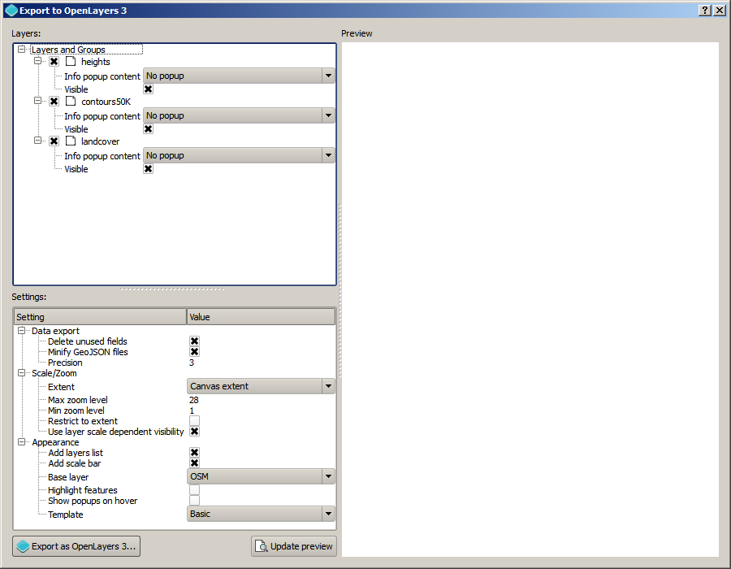

Usage
-------

In the *Export to OpenLayers 3* menu, select *Create OpenLayers 3 map* to open the main window of the plugin.

In the left-hand side you will find the list of parameters that define how the OL3 map is created. The upper half contains the list of layers to include, while the lower part contains the settings that allow you adjusting the resulting OL3 map to your needs.

You can preview the resulting layer in the panel on the right-hand sind of the window, by clicking the *Update preview* button. When you want to save the results to a folder of your choice, click on the *Export to OpenLayers 3* button. A folder selector dialog will be shown. Select the folder where you want to save the resulting OL3 map.

Configuration
--------------

The list of layers contains the following types of layers:

- Vector layers: They will be exported in GeoJSON format and reprojected into the default projection of the OL3 map to create. (EPSG:3857)

 For each vector layer, you will see a field named *Info popup content* where you can specify the field to use for showing its data in a popup when the features of the layer are clicked. If the *Show all attributes* option is selected, the whole set of attributes will be displayed. If a given field is selected, the content of the field will be displayed. Formatting is supported, since the content of the field is assumed to be HTML code and will be treated as such.

- Raster layers: They will be exported to jpeg file and reprojected into the default projection of the OL3 map to create. (EPSG:3857). The symbology is not used, so the layer must be a rendered image already. You can use the QGIS *Save as rendered image* fuctionality to get such an image from your data and symbology.

- WMS layers: They will be added to the map as they are in QGIS. The service must support serving them in the EPSG:3857 CRS.

- Groups: QGIS groups. They will be added to the map, wrapping the layers they contain. Layers will not be added individually, and it will not be possible to enable/disable them separately or add a popup with attribute information for layers belonging to a group.

All layers in your QGIS project will be added to the OL3 map. If you do not want to add a given layer, just uncheck the check box corresponding to that layer.

All layers and groups have a *Visible* field, enabled by default. If the corresponding check box is unchecked, the layer will be added to the OL3 map, but will be not visible when opening it. The layer can be made visible on the OL3 map by enabling it in the layers list panel.

The following settings are available to configure how the OL3 map is created:

- *Data export*: These parameters control how GeoJSON files are created from QGIS vector layers to include:

	- *Delete unused fields*: Do not export fields that are not used. That includes all fields that are not needed for the symbology/labeling or for the popup content, which will not be saved if this option is enabled.
	
	- *Minify GeoJSON files*: Reduce size of resulting GeoJSON files by removing unnecessary data such as blank spaces or line breaks.
	
	- *Precision*: Number of decimal places to use when storing coordinates

- *Scale zoom*

	- *Extent*: The extent to use, whether the current extent of the canvas or the minimum one needed to cover all the layers to tadd to the OL3 map
	
	- *Max zoom level*
	
	- *Min zoom level*
	
	- *Restrict to extent*. Do not allow the OL3 map to be panned outside of the extent area
	
	- *Use layer extent visibility*: If defined in the QGIS rendering properties, layers will only be visible in the OL3 map when they are within the allowed scaled range.

- *Appearance*
	
	- *Add layers list*. Add a panel with a list of layers. Notice that, if you have some layer not set to *visible*, you must add this panel. Otherwise, the user will not be able to turn the layer visibility on.
	
	- *Add scale bar*
	
	- *Base layer*. The base layer to add.
	
	- *Highlight features*. Highlight features when moving the mouse cursor over them.
	
	- *Show popups on hover*. If checked, popups with feature info will not be shown when clicking a feature, but instead when hovering over it.
	
	- *Template*. The template to use. There is currently only one template available, but you can find instructions about how to write new ones in `here <./templates.rst>`_.

